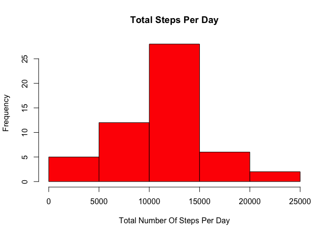
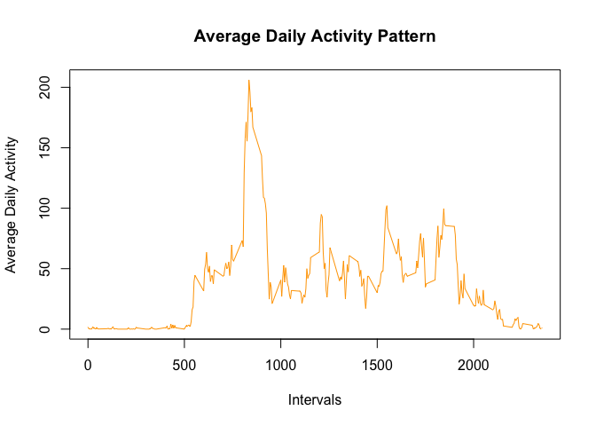
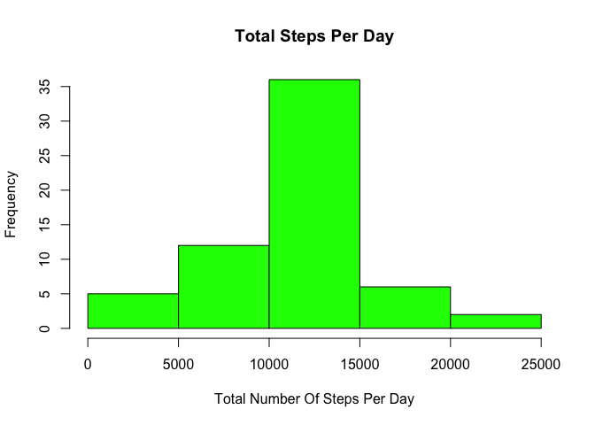
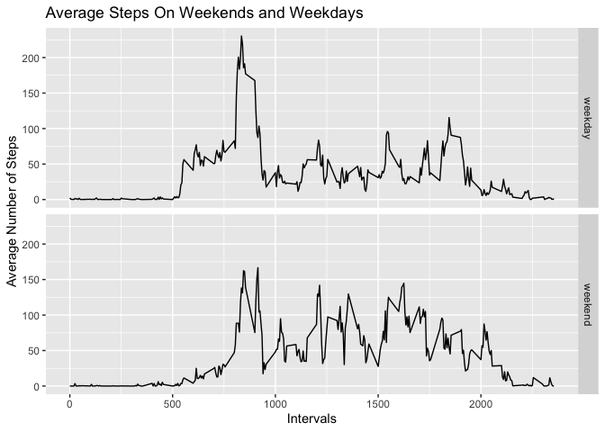

## Working Environment
R version 4.0.3 (2020-10-10)  
Platform: x86_64-apple-darwin17.0 (64-bit)  
Running under: macOS Big Sur 10.16  

## Loading and preprocessing the data

```r
library(ggplot2)
library(dplyr)
```

```
## 
## Attaching package: 'dplyr'
```

```
## The following objects are masked from 'package:stats':
## 
##     filter, lag
```

```
## The following objects are masked from 'package:base':
## 
##     intersect, setdiff, setequal, union
```

```r
if(!file.exists("./activity.csv")){unzip(zipfile="./activity.zip")}
activity <- read.csv("activity.csv")
head(activity)
```

```
##   steps       date interval
## 1    NA 2012-10-01        0
## 2    NA 2012-10-01        5
## 3    NA 2012-10-01       10
## 4    NA 2012-10-01       15
## 5    NA 2012-10-01       20
## 6    NA 2012-10-01       25
```

```r
summary(activity)
```

```
##      steps            date              interval     
##  Min.   :  0.00   Length:17568       Min.   :   0.0  
##  1st Qu.:  0.00   Class :character   1st Qu.: 588.8  
##  Median :  0.00   Mode  :character   Median :1177.5  
##  Mean   : 37.38                      Mean   :1177.5  
##  3rd Qu.: 12.00                      3rd Qu.:1766.2  
##  Max.   :806.00                      Max.   :2355.0  
##  NA's   :2304
```

```r
# Remove the missings by subsetting the data 
# Make date a DATE type instead of char

goodData <- subset(activity,steps !="NA")
goodData$date <- as.Date(goodData$date)
head(goodData)
```

```
##     steps       date interval
## 289     0 2012-10-02        0
## 290     0 2012-10-02        5
## 291     0 2012-10-02       10
## 292     0 2012-10-02       15
## 293     0 2012-10-02       20
## 294     0 2012-10-02       25
```

```r
summary(goodData)
```

```
##      steps             date               interval     
##  Min.   :  0.00   Min.   :2012-10-02   Min.   :   0.0  
##  1st Qu.:  0.00   1st Qu.:2012-10-16   1st Qu.: 588.8  
##  Median :  0.00   Median :2012-10-29   Median :1177.5  
##  Mean   : 37.38   Mean   :2012-10-30   Mean   :1177.5  
##  3rd Qu.: 12.00   3rd Qu.:2012-11-16   3rd Qu.:1766.2  
##  Max.   :806.00   Max.   :2012-11-29   Max.   :2355.0
```
## What is mean total number of steps taken per day?

```r
stepsPerDay <- goodData %>% 
  group_by(date) %>% 
  summarize(totalSteps=sum(steps),meanTotalSteps=mean(steps),
            medianTotalSteps=median(steps))

head(stepsPerDay)
```

```
## # A tibble: 6 x 4
##   date       totalSteps meanTotalSteps medianTotalSteps
##   <date>          <int>          <dbl>            <dbl>
## 1 2012-10-02        126          0.438                0
## 2 2012-10-03      11352         39.4                  0
## 3 2012-10-04      12116         42.1                  0
## 4 2012-10-05      13294         46.2                  0
## 5 2012-10-06      15420         53.5                  0
## 6 2012-10-07      11015         38.2                  0
```

```r
summary(stepsPerDay)
```

```
##       date              totalSteps    meanTotalSteps    medianTotalSteps
##  Min.   :2012-10-02   Min.   :   41   Min.   : 0.1424   Min.   :0       
##  1st Qu.:2012-10-16   1st Qu.: 8841   1st Qu.:30.6979   1st Qu.:0       
##  Median :2012-10-29   Median :10765   Median :37.3785   Median :0       
##  Mean   :2012-10-30   Mean   :10766   Mean   :37.3826   Mean   :0       
##  3rd Qu.:2012-11-16   3rd Qu.:13294   3rd Qu.:46.1597   3rd Qu.:0       
##  Max.   :2012-11-29   Max.   :21194   Max.   :73.5903   Max.   :0
```

```r
  hist(stepsPerDay$totalSteps, 
     xlab="Total Number Of Steps Per Day", 
     main="Total Steps Per Day",
     col="red")
```

<!-- -->

```r
  meanSteps <- mean(stepsPerDay$totalSteps)
  medianSteps <- median(stepsPerDay$totalSteps)
  cat(c("The mean of total steps per day is: ",meanSteps))
```

```
## The mean of total steps per day is:  10766.1886792453
```

```r
  cat(c("The median of total steps per day is: ",medianSteps))
```

```
## The median of total steps per day is:  10765
```


## What is the average daily activity pattern?

```r
dailyAvg <- goodData %>%
  group_by(interval) %>%
  summarize(averageSteps=mean(steps))

# Make an average activity plot

plot(dailyAvg$interval, dailyAvg$averageSteps, 
     type="l",
     col="orange",
     xlab="Intervals",
     ylab="Average Daily Activity",
     main="Average Daily Activity Pattern")
```

<!-- -->

```r
# Which 5-min interval has the maximum average number of steps
intervalMax <- dailyAvg$interval[which.max(dailyAvg$averageSteps)]
cat(c("The interval with the max avg number of steps is",intervalMax,". Less steps,energy at the start."))
```

```
## The interval with the max avg number of steps is 835 . Less steps,energy at the start.
```

## Imputing missing values

```r
missing <- sum(is.na(activity))
summary(missing)
```

```
##    Min. 1st Qu.  Median    Mean 3rd Qu.    Max. 
##    2304    2304    2304    2304    2304    2304
```

```r
cat(c("There are",missing,"missing values."))
```

```
## There are 2304 missing values.
```

```r
# Copy the rawdata file: activity to imputed Dataset
# if steps==NA is found.
#    Assign (steps = averageSteps) for the given interval
imputeData <- activity
for (i in 1:nrow(imputeData)) {
  if (is.na(imputeData$steps[i])) {
    # Find the index value for when the interval matches the average
    n <- which(imputeData$interval[i] == dailyAvg$interval)
    # Assign the value to replace the NA
    imputeData$steps[i] <- dailyAvg[n,]$averageSteps
  }
}

# Make sure the date variable is still a date.
imputeData$date <- as.Date(imputeData$date)
```

```r
imputeStepsPerDay <- imputeData %>% 
  group_by(date) %>% 
  summarize(totalSteps=sum(steps),
            meanSteps=mean(steps),
            medianSteps=median(steps))
  hist(imputeStepsPerDay$totalSteps, 
     xlab="Total Number Of Steps Per Day", 
     main="Total Steps Per Day",
     col="green")
```

<!-- -->

```r
  imeanSteps <- mean(imputeStepsPerDay$totalSteps)
  imedianSteps <- median(imputeStepsPerDay$totalSteps)
  cat(c("Imputed mean of total steps per day is: ",imeanSteps,"\n"))
```

```
## Imputed mean of total steps per day is:  10766.1886792453
```

```r
  cat(c("Imputed median of total steps per day is: ",imedianSteps))
```

```
## Imputed median of total steps per day is:  10766.1886792453
```
Do these values differ from the estimates from the first part of the assignment?  
**Yes. The values do differ. The missing data included at least 2 entire days.**  
What is the impact of imputing missing data on the estimates of the total daily number of steps?      
**The mean and the median are closer to one another. **

Are there differences in activity patterns between weekdays and weekends?  
**Yes, activity starts later with less activity on the  weekends.**

```r
# Add a column "day" to define a weekday variable
imputeData$day <- weekdays(imputeData$date)
# Add a column "daytype" to identify day as a weekday
imputeData$daytype <- "weekday"
# modify days that are saturday or sunday to be weekends
imputeData$daytype[imputeData$day %in% c("Saturday", "Sunday")] <- "weekend"

# Group data by 5 minute intervals and summarize the average
# number of steps in that interval
dayAvg <- imputeData %>%
  group_by(daytype, interval,.groups='keep') %>%
  summarize(averageSteps=mean(steps))
```

```
## `summarise()` has grouped output by 'daytype', 'interval'. You can override using the `.groups` argument.
```

```r
# qplot can divide a graph by factors using facets
qplot(interval, averageSteps, data=dayAvg,
      type="l",
      geom="line",
      facets=daytype ~ .,
      xlab="Intervals",
      ylab="Average Number of Steps",
      main="Average Steps On Weekends and Weekdays")
```

<!-- -->


